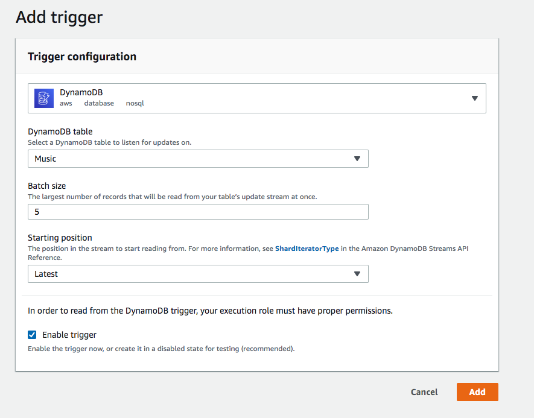

# Aws Lambda DynamoDB to Postgresql
This is a simple lambda function written in Go which catch DynamoDB stream and put them in a Postgresql table

### Create a Postgresql database with aws RDS and create a database and a table
Create a simple postgresql instance (it's fine the free tier one) </br>
Then connect to it and create a database </br>
```
CREATE DATABASE test
CREATE table jsonData(data json);
```

### in properties.ini file specify:
```
host := "database-1.ctm1ks5phyah.us-east-2.rds.amazonaws.com"
port := 5432
user := "postgres"
passwd := "postgres"
dbName := "test"
tableName := "JsonData"
```
Compile the lambda for linux: </br>
env GOOS=linux GOARCH=amd64 go build
</br>
then package it with bild-lambda-zip: </br>
GOPATH/bin/build-lambda-zip aws-lambda

### Create a lambda function
in aws console create a lambda function and load the .zip just created </br>
../../bin/build-lambda-zip aws-lambda properties.ini </br>

### Create a dynamodb table
Create a simple dynamodb table and activate streams

### In the lamdba function create a new trigger
Create a new trigger


### Add new items (reaching the batch specified) in the dynamodb table and see the streams stored in postgresql as well
